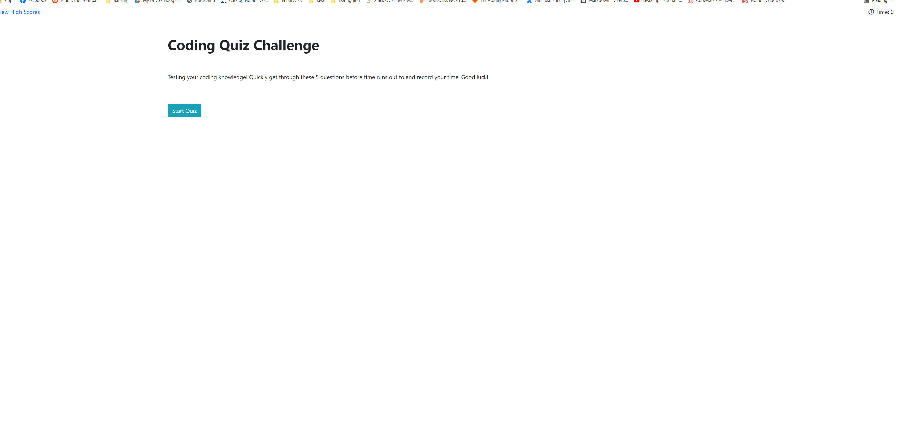
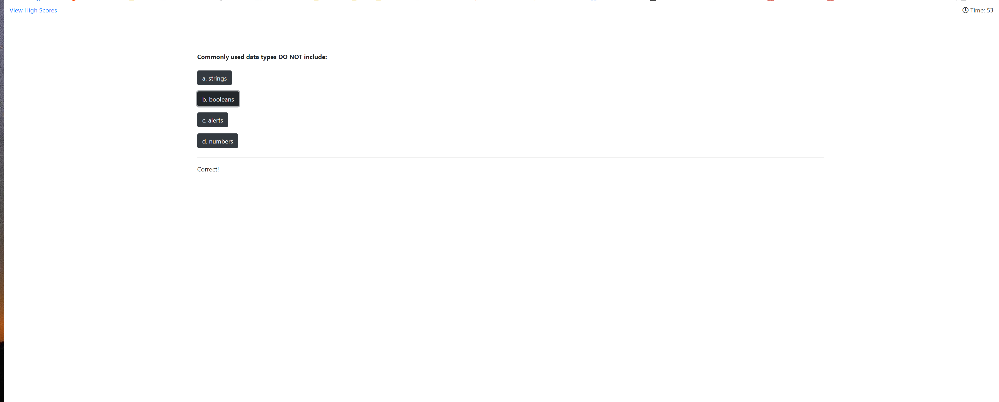
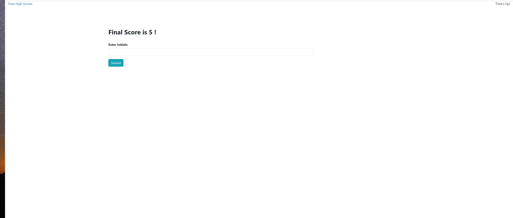
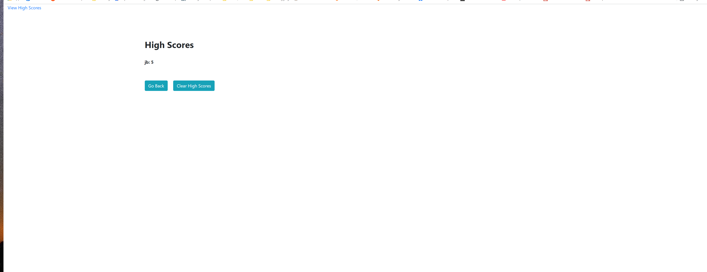

# Web-Api-Quiz
## Challenge Assignment 4

## Link to code:
https://github.com/jamesbelk0/Web-Api-Quiz

## Link to site: 
https://jamesbelk0.github.io/Web-Api-Quiz/

## Link to screenshot:

### Description

1. Generate test questions, set up 60 second timer and localStorage.

2. Played with bootstrap/jquerry to get the site functioning and looking clean

3. Fixed the start button so that the timer wouldn't start immediately on site loading.

4. Created github repo and fixed up README 